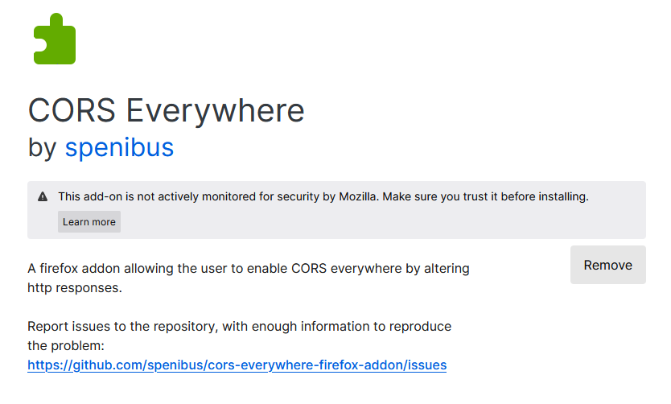
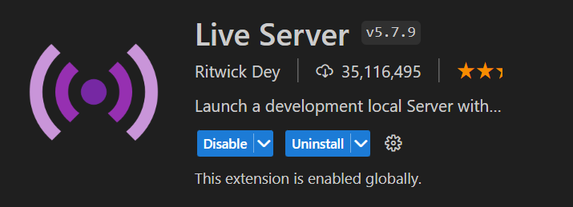
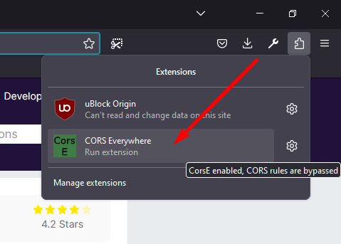
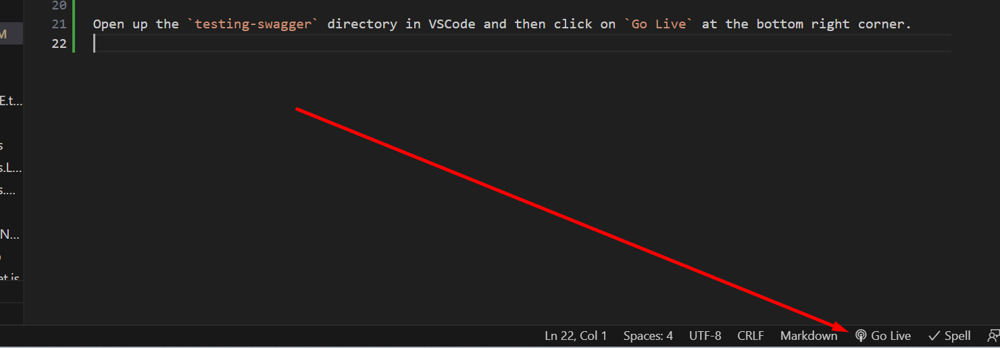
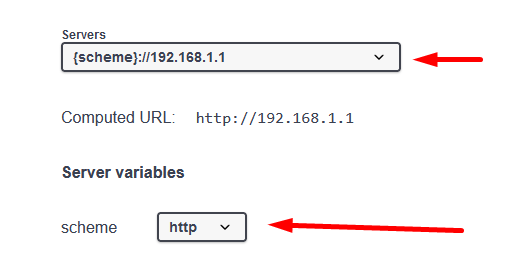
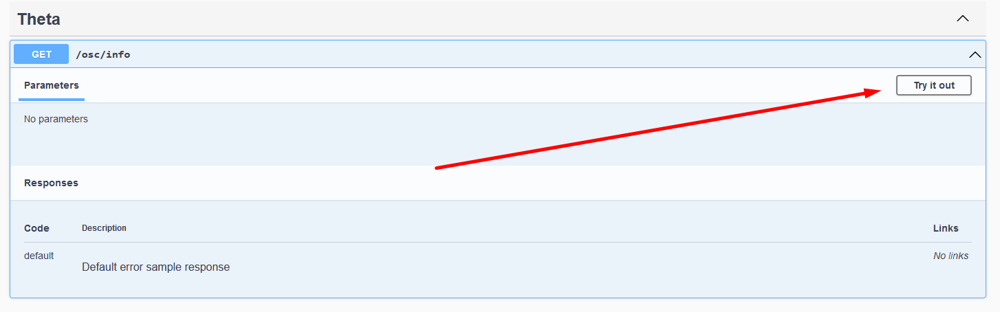
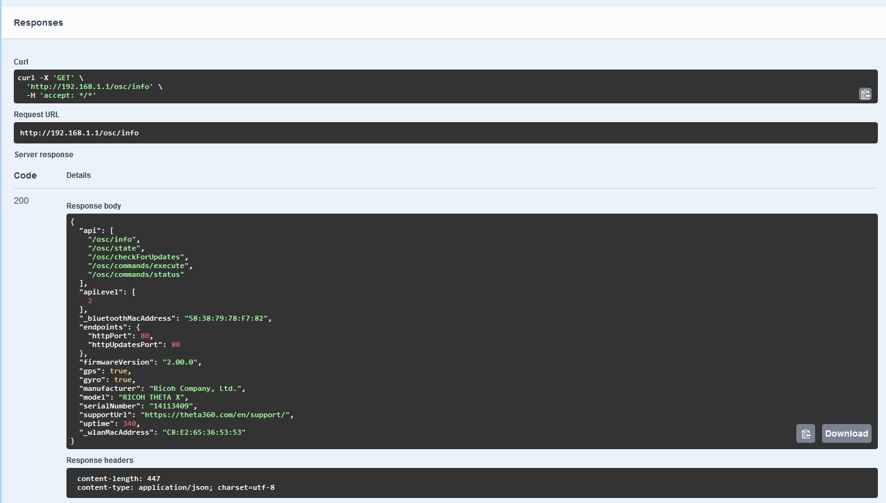

# testing-swagger

## How to Run Locally

### Installation:

In Firefox browser install CORS Everywhere addon https://addons.mozilla.org/en-US/firefox/addon/cors-everywhere/

In VSCode Editor install the Live Server extension https://marketplace.visualstudio.com/items?itemName=ritwickdey.LiveServer

### Steps:

Launch Firefox and click on the CORS Everywhere addon to enable it, it should show up as green now.

Open up the `testing-swagger` directory in VSCode and then click on `Go Live` at the bottom right corner.

Once Swagger is opened in your Browser select the server `192.168.1.1` and select the scheme as `http`

## Connect to your THETA Camera 

Then `Try It Out` on the `/osc/info` command and then press `Execute`

Here is your Response from the Camera

